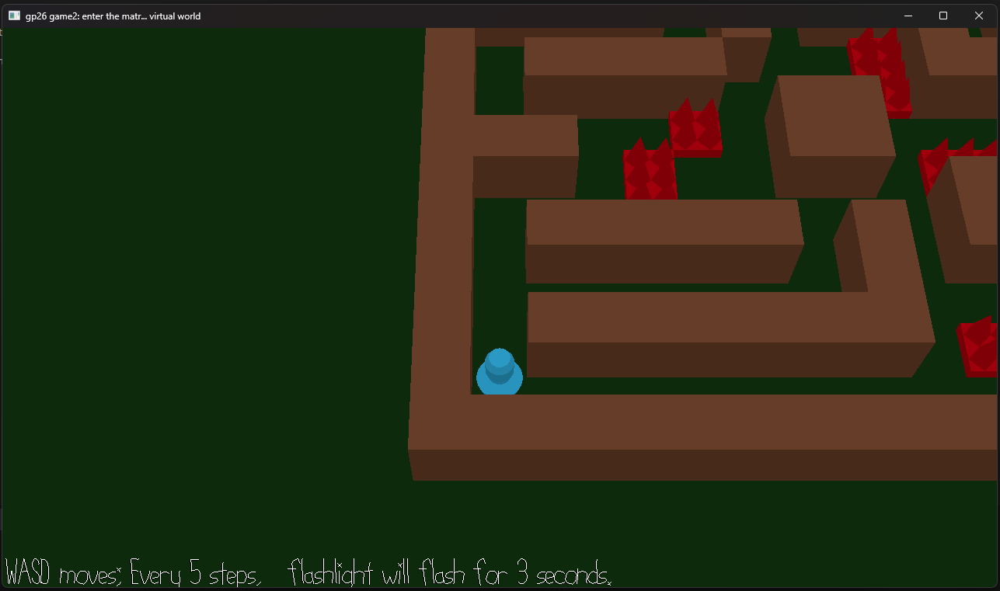

# FlashLight Hunt

Author: Jiawei Li(jiaweil8)

Design: Flashlight Hunt combines a grid-based maze game with a memory game. Players periodically see the maze, then must navigate through the darkness from memory while avoiding traps.

Screen Shot:

How To Play:

1.Use **WASD** to move the player one grid cell at a time.
2.The game begins with the scene illuminated for a few seconds, then the light turns off, you need to navigate through the maze from memory. 
3.After every five successful moves, movement is temporarily disabled and the scene is illuminated again for three seconds.
4.Each dark phase becomes progressively darker, eventually reaching complete darkness. Avoid the traps and reach the goal to win. 
5.Stepping on a trap causes you to lose. Press **R** at any time to restart the game.

This game was built with [NEST](NEST.md).
